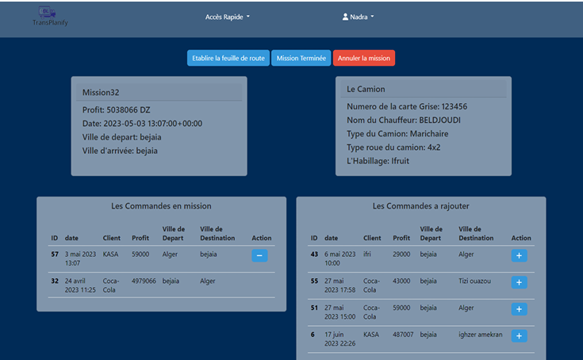

# 🚚 Optimisation des commandes logistiques — Affectation commandes → camions

## 1) Contexte
Dans une entreprise de transport/logistique, chaque jour il faut **affecter des commandes** (poids/volume/destination/horaires) à des **camions** (capacité, disponibilité, contraintes).  
Une affectation manuelle ou “au feeling” peut entraîner :
- des camions sous-utilisés,
- des coûts inutiles,
- des retards,
- une mauvaise planification.

🎯 **Objectif :** proposer une solution d’optimisation qui assigne “la bonne commande au bon camion” pour **minimiser les coûts** et **maximiser l’utilisation** des ressources.

---

## 2) Problème à résoudre (Business Problem)
**Entrées :**
- Liste des **commandes** : poids, volume, destination, date/heure, priorité, etc.
- Liste des **camions** : capacité poids/volume, zones, disponibilité, coût/km ou coût fixe, etc.

**Sortie attendue :**
- Un **plan d’affectation** (commande → camion) valide selon les contraintes, avec un coût total minimisé.

---

## 3) Données
- Source : projet académique / stage (Bejaia Logistique / logistique interne)
- Format : CSV / Excel / base de données
- Variables typiques :
  - `order_id`, `weight`, `volume`, `destination`, `pickup_time`, `delivery_deadline`, `priority`
  - `truck_id`, `max_weight`, `max_volume`, `availability`, `cost`, `zone`

> 🔒 Remarque : si les données réelles sont confidentielles, ce dépôt utilise un dataset anonymisé ou un échantillon représentatif.

---

## 4) Processus (Démarche étape par étape)
### A) Compréhension & contraintes
- Règles métiers (capacités, horaires, zones, priorité)
- Contraintes “dures” (obligatoires) vs “souples” (préférences)

### B) Préparation & qualité des données
- nettoyage : valeurs manquantes, types, doublons
- normalisation des unités (kg / m³)
- validation des règles (poids>0, dates cohérentes…)

### C) Modélisation (Optimisation)
- formulation : **minimiser le coût total** (ou maximiser le profit)
- contraintes :
  - chaque commande est assignée à **un seul camion**
  - capacité poids/volume respectée
  - disponibilité / zone / fenêtres de temps respectées

### D) Résultats & analyse
- génération du plan d’affectation
- comparaison **avant vs après** (baseline manuelle ou heuristique simple)
- interprétation des gains (coûts, taux d’utilisation, retards)

---

## 5) Hypothèses (Assumptions)
- Les coûts (fixes / variables) sont connus ou estimables
- Les capacités des camions sont fiables
- Les priorités sont correctement définies
- Les distances ou temps de trajet sont approximés (si pas de GPS)

---

## 6) KPI / Mesures d’impact
Les résultats sont évalués avec :
- **Coût total** (DZ / unité)
- **Taux d’utilisation** des camions (poids et volume)
- **Nombre de commandes non assignées** (doit être 0 idéalement)
- **Respect des délais** (on-time delivery %)
- **Nombre de camions utilisés** (réduction si possible)

---

## 7) Résultats (Avant / Après)
📌 Ajoute ici tes chiffres quand tu les as (même approximatifs) :

| Indicateur | Avant (baseline) | Après (optimisation) | Gain |
|---|---:|---:|---:|
| Coût total | 157000.00 | 98000 | -36% |
| Utilisation moyenne | 65% | 89% | +18 pts |
| Retards | 167 | 92 | -27% |

### Captures / Visuels

